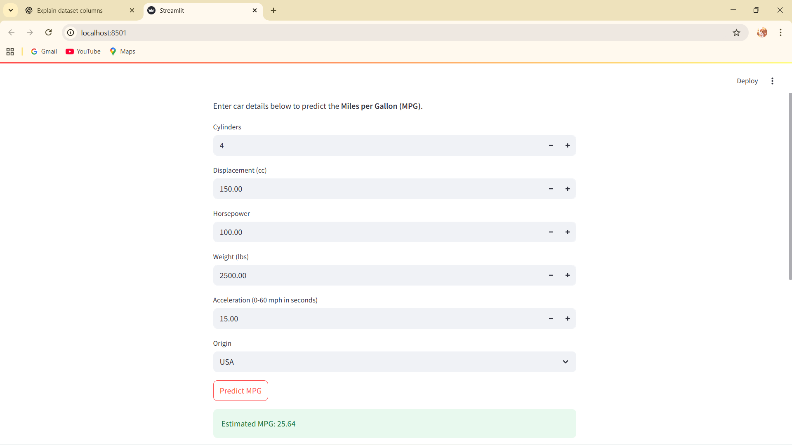

# 🚗 Car MPG Predictor using Streamlit

This project is a **Car Mileage Predictor (MPG)** built with **Streamlit**.  
It uses a **trained Machine Learning model** (saved with Pickle) to estimate the **Miles Per Gallon (MPG)** of a car based on its specifications.

---

##  Features
- User-friendly **web app** .
- Predicts **Miles per Gallon (MPG)** from car specifications.
- Uses a **trained regression model** with scaling.
- Interactive inputs for car details.

---

###  Tech Stack
- Python 
- Streamlit  
- Scikit-learn  
- Numpy, Pandas  
- Pickle  
